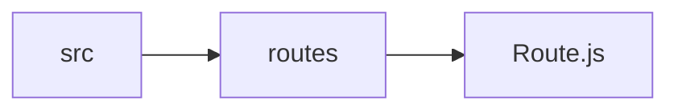
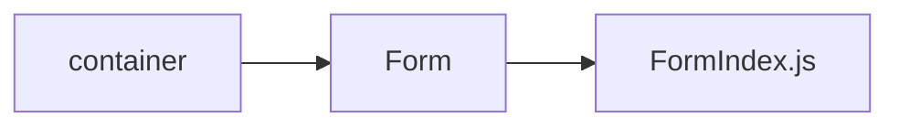

# Read & Start

This document is all about basic file structure and naming conventions that is being followed

## Step 1. Cloning Boilerplate

Run following **four** commands to clone the boilerplate:

```
1. git clone https://git.xenonstack.com/util/react-boilerplate.git
2. cd react-boilerplate.
3. npm install.
4. Run npm start to see the example app at http://localhost:8080.
```

## Step 2. Structuring src/index.js 


#### Import files

```
// Provider makes the Redux store available to any nested components that have been wrapped in the connect() function.
import { Provider } from 'react-redux';
```
```
//BrowserRouter is parent component that is used to store all of your `<Route>` components
import { BrowserRouter, Route } from 'react-router-dom';
```
```
//Creates a Redux store that holds the complete state tree of your app.
import { applyMiddleware, createStore } from 'redux';
```
```
// thunk us call action creators that return a function instead of an action object.
import thunk from 'redux-thunk';
```

```
// common css files for whole project
import "./static/css/common.css";
import "./static/css/primary.css";
import "./static/css/grid.css";
import "./static/css/font-awesome.css";
import "./static/css/forms.css";
import './static/css/simple-line-icons.css';
```

```
import combineReducers from './reducers';

// apiMiddleware that contains all the middleware function: getApi,postApi etc.
import apiMiddleware from './middleware';
```

```
// RouteComponent For wrapping it in <Provider> & <BrowseRoute>
import RouteComponent from './routes/Route';

```
#### Creating store to hold the complete state tree

```
export const store = createStore( combineReducers, 
    applyMiddleware(thunk, apiMiddleware.getApi, apiMiddleware.postApi, 
    apiMiddleware.putApi, apiMiddleware.deleteApi, apiMiddleware.restApi, middleware));
```

#### Rendering & wrapping Routes

1. Pass `store` as props to `<Provider>` .
2. Wrap the `<RouteComponent/>` in `<BrowserRouter>` and  `<Provider>` .

```
const Rout = (
    <Provider store={store}>
        <BrowserRouter>
            <RouteComponent />
        </BrowserRouter>
    </Provider>
);

ReactDOM.render(Rout, document.getElementById('root'));
```

## Step 3. Defining Routes and Structuring

a) Routes will be defined in `Route.js` file like:

```
<Switch>
     <Route exact path="/" component={demoComponent} />
     <Route path="/form" component={FormIndex} />
</Switch>
```


>Here we define the main route for FormIndex in Route.js File 


b) `Sub-Routes` will be defined in their respective folders like:


```
<Switch>
	<Route  exact  path="/form"  component={BasicInfoForm}  />
	<ProtectedRoute  path="/form/BasicInfoForm"  component={BasicInfoForm}  />
	<ProtectedRoute  path='/form/EmployeeForm'  component={EmployeeForm}/>
</Switch>
```

> Here we define all the sub-folder for FormIndex under the Form folder

## Step 4. Rules for Creating new css files

To add add new css file , create a `dist` folder under your respective folder and add css classes in that folder. For eg:

```
your-working-folder/
    dist/
        style.css
    index.js
```
##  Step 5. Config File
Update environment variable in `config.js` file located in `/src/config.js` for different environment.


##  Step 6. Redux Flow


## 6.1 Constants

Create the constants under **src/constants** folder. Naming conventions for file name will be **Camel Case** . For eg(Filenames):
```
1. formContants.js 
2. projectConstants.js
```
## 6.2 Actions 

Actions will be created under **src/actions** . 
Steps to create a actions file:

#### Create a file 
```
src/actions/FormActions.js
```
#### Import the constants that are needed:
```
import {GET_FORM_REQUEST,GET_FORM_SUCCESS,GET_FORM_FAILURE} from '../constants/formConstants';
```

#### Import the middleware :
```
import { GET_API,PUT_API,POST_API,DELETE_API} from "../middleware/symbols";
```

#### Import Base Urls of API's from **APIAction.js** file created under **src/actions** folder
```
import { baseApi } from "./ApiActions";
```
#### Create **Action Creator** like this:
```
const BASE_URL = baseApi()

export function getData() {
    return {
        [GET_API]:{
            endpoint: BASE_URL + '/parameters',
            authenticated: true,
            types: [ GET_FORM_REQUEST,GET_FORM_SUCCESS,GET_FORM_FAILURE],
        }
    }

```

### ApiActions.js file
This file contains functions that export all the environment variable that are mentioned in the `config.js` file.
```
import config from "../config";

export function baseApi() {
    return config.app.REACT_APP_BASE_URL;
}
```

## 6.3 Reducers

Reducer files will be created under **src/reducer** . 
Import reducers from the reducers export all, making this as root reducer. 
Steps to create a reducer file:

### Create a combine reducer file that will export all the reducer.

```
import { combineReducers } from 'redux';

 
 export default combineReducers({
	 File1Reducer
 })
```

### Create reducer file like:

```
 importing constants
 Defining initialState
 Returning all the constant with states.
```

### Note
1. Use best practices for code.
2. Use proper commenting   

